# Activity Diagram - Pemesanan Kendaraan

## Alur Proses Pemesanan Kendaraan dengan Multi-Level Approval

```mermaid
flowchart TD
    Start([Mulai]) --> AdminLogin[Admin Login ke Sistem]
    AdminLogin --> ViewVehicles[Lihat Daftar Kendaraan Tersedia]
    ViewVehicles --> SelectVehicle{Pilih Kendaraan}
    
    SelectVehicle -->|Tidak Ada Kendaraan| ViewVehicles
    SelectVehicle -->|Ada Kendaraan| FillForm[Isi Form Pemesanan:<br/>- Nama Klien<br/>- Nomor Telepon Klien<br/>- Pilih Driver<br/>- Tanggal Mulai/Selesai<br/>- Tujuan & Destinasi<br/>- Pilih Min 2 Approvers]
    
    FillForm --> ValidateForm{Validasi Form}
    ValidateForm -->|Invalid| FillForm
    ValidateForm -->|Valid| CreateBooking[Buat Booking<br/>Status: PENDING]
    
    CreateBooking --> LogBookingCreated[📝 Log: Booking Created by Admin]
    LogBookingCreated --> NotifyApprovers[🔔 Notifikasi ke Admin & Approvers]
    NotifyApprovers --> WaitApproval1[⏳ Menunggu Approval Level 1]
    
    WaitApproval1 --> Approver1Login[Approver Level 1 Login]
    Approver1Login --> ViewApprovalList1[Lihat Daftar Booking<br/>yang Perlu Approval]
    ViewApprovalList1 --> ReviewBooking1[Review Detail Booking:<br/>- Kendaraan<br/>- Klien/Pemesan<br/>- Driver<br/>- Tanggal<br/>- Tujuan]
    
    ReviewBooking1 --> Decision1{Keputusan<br/>Approver 1}
    Decision1 -->|Reject| RejectBooking1[Set Status Approval 1: REJECTED]
    RejectBooking1 --> LogRejected1[📝 Log: Approval 1 Rejected]
    LogRejected1 --> UpdateBookingRejected[Update Booking Status: REJECTED]
    UpdateBookingRejected --> NotifyDriverRejected[🔔 Notifikasi Driver: Ditolak]
    NotifyDriverRejected --> End1([Selesai - Ditolak])
    
    Decision1 -->|Approve| ApproveBooking1[Set Status Approval 1: APPROVED<br/>+ Timestamp]
    ApproveBooking1 --> LogApproved1[📝 Log: Approval 1 Approved]
    LogApproved1 --> CheckAllApprovals{Apakah Semua<br/>Approvers<br/>Sudah Approve?}
    
    CheckAllApprovals -->|Belum| WaitApproval2[⏳ Menunggu Approval Level 2]
    WaitApproval2 --> Approver2Login[Approver Level 2 Login]
    Approver2Login --> ViewApprovalList2[Lihat Daftar Booking<br/>yang Perlu Approval]
    ViewApprovalList2 --> ReviewBooking2[Review Detail Booking]
    
    ReviewBooking2 --> Decision2{Keputusan<br/>Approver 2}
    Decision2 -->|Reject| RejectBooking2[Set Status Approval 2: REJECTED]
    RejectBooking2 --> LogRejected2[📝 Log: Approval 2 Rejected]
    LogRejected2 --> UpdateBookingRejected2[Update Booking Status: REJECTED]
    UpdateBookingRejected2 --> NotifyDriverRejected2[🔔 Notifikasi Driver: Ditolak]
    NotifyDriverRejected2 --> End2([Selesai - Ditolak])
    
    Decision2 -->|Approve| ApproveBooking2[Set Status Approval 2: APPROVED<br/>+ Timestamp]
    ApproveBooking2 --> LogApproved2[📝 Log: Approval 2 Approved]
    LogApproved2 --> CheckAllApprovals
    
    CheckAllApprovals -->|Semua Sudah Approve| UpdateBookingApproved[Update Booking Status: APPROVED]
    UpdateBookingApproved --> UpdateVehicleStatus[Update Vehicle Status: DIGUNAKAN]
    UpdateVehicleStatus --> LogVehicleUsed[📝 Log: Vehicle Status Changed to DIGUNAKAN]
    LogVehicleUsed --> NotifyDriverApproved[🔔 Notifikasi ke Admin & Driver: Disetujui]
    NotifyDriverApproved --> CreateUsageLog[Buat Vehicle Log:<br/>Type: USAGE<br/>Record Odometer Start]
    
    CreateUsageLog --> VehicleInUse[🚗 Kendaraan Sedang Digunakan]
    VehicleInUse --> WaitCompletion[⏳ Menunggu Booking Selesai]
    
    WaitCompletion --> DriverComplete[Driver Menyelesaikan Perjalanan]
    DriverComplete --> InputFuelData[Input Data Setelah Pakai:<br/>- Odometer End<br/>- BBM yang Dipakai<br/>- Catatan]
    
    InputFuelData --> ValidateFuelData{Validasi Data}
    ValidateFuelData -->|Invalid| InputFuelData
    ValidateFuelData -->|Valid| UpdateUsageLog[Update Vehicle Log:<br/>- Odometer End<br/>- Distance<br/>- Fuel Used]
    
    UpdateUsageLog --> UpdateVehicleOdometer[Update Vehicle Odometer]
    UpdateVehicleOdometer --> CalculateConsumption[Hitung Konsumsi BBM Aktual]
    CalculateConsumption --> CheckServiceSchedule{Apakah Perlu<br/>Service?}
    
    CheckServiceSchedule -->|Ya - Days ≤ 7<br/>atau KM ≤ 500| AlertService[🔔 Alert: Kendaraan Perlu Service Segera]
    CheckServiceSchedule -->|Tidak| NoAlert[Tidak Ada Alert]
    
    AlertService --> CompleteBooking
    NoAlert --> CompleteBooking[Update Booking Status: COMPLETED]
    
    CompleteBooking --> LogBookingCompleted[📝 Log: Booking Completed]
    LogBookingCompleted --> UpdateVehicleAvailable[Update Vehicle Status: TERSEDIA]
    UpdateVehicleAvailable --> LogVehicleAvailable[📝 Log: Vehicle Status Changed to TERSEDIA]
    LogVehicleAvailable --> GenerateReport[Generate Report:<br/>- Fuel Consumption<br/>- Distance<br/>- Duration]
    
    GenerateReport --> End3([Selesai - Completed])

    style Start fill:#90EE90
    style End1 fill:#FFB6C6
    style End2 fill:#FFB6C6
    style End3 fill:#90EE90
    style CreateBooking fill:#87CEEB
    style UpdateBookingApproved fill:#87CEEB
    style CompleteBooking fill:#87CEEB
    style Decision1 fill:#FFD700
    style Decision2 fill:#FFD700
    style LogBookingCreated fill:#E6E6FA
    style LogApproved1 fill:#E6E6FA
    style LogApproved2 fill:#E6E6FA
    style LogRejected1 fill:#E6E6FA
    style LogRejected2 fill:#E6E6FA
    style LogBookingCompleted fill:#E6E6FA
    style LogVehicleUsed fill:#E6E6FA
    style LogVehicleAvailable fill:#E6E6FA
```



## Penjelasan Alur:

### **Phase 1: Pembuatan Booking (Admin)**
1. Admin login ke sistem
2. Melihat daftar kendaraan yang statusnya **TERSEDIA**
3. Pilih kendaraan yang akan digunakan
4. Isi form pemesanan:
   - **Nama klien/pemesan**
   - **Nomor telepon klien**
   - Pilih driver yang akan mengendarai
   - Tanggal mulai & selesai
   - Tujuan pemesanan & destinasi
   - Pilih **minimum 2 approvers** (multi-level)
5. Submit form → Booking dibuat dengan status **PENDING**
6. **Log aplikasi:** Booking created by Admin
7. Notifikasi dikirim ke admin dan semua approvers

### **Phase 2: Approval Level 1**
1. Approver Level 1 (misal: Manager Operasional) login
2. Melihat daftar booking yang perlu approval
3. Review detail booking
4. **Keputusan:**
   - **REJECT** → Booking status jadi **REJECTED** → Selesai (ditolak)
   - **APPROVE** → Approval level 1 status jadi **APPROVED** → Lanjut ke level 2
5. **Log aplikasi:** Approval 1 approved/rejected

### **Phase 3: Approval Level 2**
1. Approver Level 2 (misal: Direktur) login
2. Melihat daftar booking yang perlu approval
3. Review detail booking
4. **Keputusan:**
   - **REJECT** → Booking status jadi **REJECTED** → Selesai (ditolak)
   - **APPROVE** → Approval level 2 status jadi **APPROVED**
5. **Log aplikasi:** Approval 2 approved/rejected

### **Phase 4: Semua Approval Complete**
1. Cek apakah **SEMUA approvers sudah approve**
2. Jika **YA**:
   - Booking status → **APPROVED**
   - Vehicle status → **DIGUNAKAN**
   - **Log aplikasi:** Vehicle status changed
   - Notifikasi ke driver: Booking disetujui
   - Buat vehicle log dengan type **USAGE** (record odometer start)

### **Phase 5: Penggunaan Kendaraan**
1. Kendaraan sedang digunakan (status **DIGUNAKAN**)
2. Menunggu booking selesai

### **Phase 6: Penyelesaian Booking**
1. Driver selesai menggunakan kendaraan
2. Input data:
   - **Odometer End** (KM akhir)
   - **BBM yang dipakai** (Liter)
   - Catatan (opsional)
3. Update vehicle log:
   - Distance = Odometer End - Odometer Start
   - Fuel Used = BBM yang dipakai
4. Update vehicle odometer
5. **Hitung konsumsi BBM aktual** (Liter/100KM)
6. **Cek jadwal service:**
   - Jika days until service ≤ 7 hari **ATAU** km until service ≤ 500 KM
   - → **ALERT: Kendaraan perlu service segera**
7. Booking status → **COMPLETED**
8. Vehicle status → **TERSEDIA**
9. **Log aplikasi:** Booking completed & Vehicle available
10. Generate report (fuel consumption, distance, duration)

## Logging Points (📝):

Setiap proses penting di-log untuk audit trail:

1. ✅ **Booking Created** - Ketika driver buat booking
2. ✅ **Approval Approved/Rejected** - Ketika approver buat keputusan
3. ✅ **Vehicle Status Changed** - Ketika vehicle status berubah
4. ✅ **Booking Completed** - Ketika booking selesai
5. ✅ **Fuel & Odometer Logged** - Ketika data BBM & KM dicatat

## Multi-Level Approval Rules:

- **Minimum 2 approvers** harus dipilih saat buat booking
- Approval dilakukan **secara berurutan** (level 1 → level 2 → ...)
- Jika **1 approver reject**, booking langsung **REJECTED** (tidak lanjut ke level berikutnya)
- Booking baru **APPROVED** kalau **SEMUA approvers approve**
- Vehicle status baru jadi **DIGUNAKAN** kalau booking sudah **APPROVED**

## Status Transitions:

### **Booking Status:**
```
PENDING → APPROVED → COMPLETED
   ↓
REJECTED (terminal state)
```

### **Vehicle Status:**
```
TERSEDIA → DIGUNAKAN → TERSEDIA
   ↓
MAINTENANCE (manual)
```

## Notifications (🔔):

1. **Notifikasi ke Approvers** - Ketika ada booking baru
2. **Notifikasi ke Driver** - Ketika booking disetujui/ditolak
3. **Alert Service** - Ketika kendaraan perlu service segera
