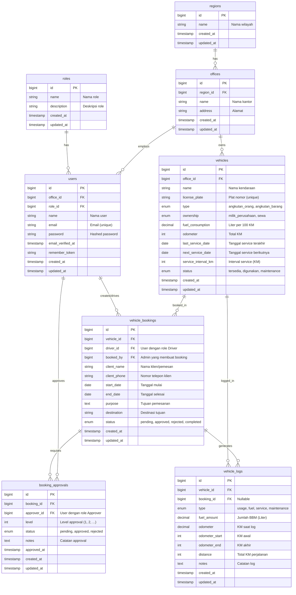

# Physical Data Model (ERD)
## Vehicle Booking System Database Design



## Penjelasan Relasi:

### **1. roles → users (One to Many)**
- Satu role bisa dimiliki banyak users
- User harus punya 1 role: Admin, Approver, Driver

### **2. regions → offices (One to Many)**
- Satu region bisa punya banyak offices
- Office harus berada di 1 region

### **3. offices → users (One to Many)**
- Satu office bisa punya banyak employees (users)
- User harus terdaftar di 1 office

### **4. offices → vehicles (One to Many)**
- Satu office bisa punya banyak vehicles
- Vehicle harus terdaftar di 1 office

### **5. users → vehicle_bookings (One to Many)**
- Satu user (driver) bisa membuat banyak bookings
- Booking harus punya 1 driver

### **6. vehicles → vehicle_bookings (One to Many)**
- Satu vehicle bisa di-booking berkali-kali (tidak bersamaan)
- Booking harus untuk 1 vehicle

### **7. vehicle_bookings → booking_approvals (One to Many)**
- Satu booking bisa punya banyak approvals (multi-level)
- Approval harus untuk 1 booking

### **8. users → booking_approvals (One to Many)**
- Satu user (approver) bisa approve banyak bookings
- Approval harus dilakukan oleh 1 approver

### **9. vehicles → vehicle_logs (One to Many)**
- Satu vehicle bisa punya banyak logs (history)
- Log harus untuk 1 vehicle

### **10. vehicle_bookings → vehicle_logs (One to Many)**
- Satu booking bisa generate banyak logs (fuel, usage, dll)
- Log bisa tanpa booking (untuk maintenance, service)

## Indexes & Constraints:

### **Primary Keys:**
- Semua table punya `id` sebagai PRIMARY KEY (AUTO_INCREMENT)

### **Foreign Keys:**
```sql
-- users table
FOREIGN KEY (office_id) REFERENCES offices(id) ON DELETE CASCADE
FOREIGN KEY (role_id) REFERENCES roles(id) ON DELETE CASCADE

-- offices table
FOREIGN KEY (region_id) REFERENCES regions(id) ON DELETE CASCADE

-- vehicles table
FOREIGN KEY (office_id) REFERENCES offices(id) ON DELETE CASCADE

-- vehicle_bookings table
FOREIGN KEY (vehicle_id) REFERENCES vehicles(id) ON DELETE CASCADE
FOREIGN KEY (driver_id) REFERENCES users(id) ON DELETE CASCADE

-- booking_approvals table
FOREIGN KEY (booking_id) REFERENCES vehicle_bookings(id) ON DELETE CASCADE
FOREIGN KEY (approver_id) REFERENCES users(id) ON DELETE CASCADE

-- vehicle_logs table
FOREIGN KEY (vehicle_id) REFERENCES vehicles(id) ON DELETE CASCADE
FOREIGN KEY (booking_id) REFERENCES vehicle_bookings(id) ON DELETE SET NULL
```

### **Unique Constraints:**
- `users.email` - Email harus unique
- `vehicles.license_plate` - Plat nomor harus unique

### **Default Values:**
- `vehicles.status` = 'tersedia'
- `vehicles.odometer` = 0
- `vehicles.service_interval_km` = 5000
- `vehicle_bookings.status` = 'pending'
- `booking_approvals.status` = 'pending'

## Business Rules:

1. **User harus punya role dan office**
2. **Vehicle status:**
   - `tersedia` - Bisa di-booking
   - `digunakan` - Sedang dipakai (ada booking approved)
   - `maintenance` - Tidak bisa di-booking

3. **Booking workflow:**
   - Status awal: `pending`
   - Butuh minimum 2 approvals (multi-level)
   - Status jadi `approved` kalau semua approver sudah approve
   - Status jadi `rejected` kalau ada 1 approver yang reject
   - Status jadi `completed` kalau booking sudah selesai

4. **Vehicle logs:**
   - `usage` - Log pemakaian kendaraan
   - `fuel` - Log pengisian BBM
   - `service` - Log service kendaraan
   - `maintenance` - Log maintenance

5. **Service schedule:**
   - Auto-calculate `next_service_date` berdasarkan `service_interval_km`
   - Alert kalau `days_until_service <= 7` atau `km_until_service <= 500`
